# Smart-Sensor

Analysis of various HR/BR estimation algorithms from accelerometer data. The goal is to extract/summarize the resting-state respiration rate and/or heart rate from wrist-accelerometer data. 

#### Datasets
* [UCI Mhealth Dataset](https://archive.ics.uci.edu/ml/datasets/MHEALTH+Dataset) - Dataset 1 - Wrist Accelerometer data of 62 seconds at 50Hz sampling frequency
* [Dataset for ADL Recognition with Wrist-worn Accelerometer Data Set](https://archive.ics.uci.edu/ml/datasets/Dataset+for+ADL+Recognition+with+Wrist-worn+Accelerometer) - Dataset 2 and 3 - Accelerometer data of 22 and 21 seconds resepctively of 32Hz sampling frequency

#### Publications
* [Bio Watch](https://www.researchgate.net/publication/301449389_BioWatch_Estimation_of_Heart_and_Breathing_Rates_from_Wrist_Motions)
* [Sleep Monitor](http://mcn.cse.psu.edu/paper/xiaosun/ubicomp-xiao17.pdf)
* [SeismoTracker](https://dl.acm.org/citation.cfm?id=2892279)

### Results

Dataset 1: (datasets/uic_dataset.csv)

|               | Heart Rate(bpm) | Breathing Rate(bpm) |
|---------------|-----------------|---------------------|
| Bio Watch     | 62.420359       | 21.607122           |
| SeismoTracker | 46.415109       | 12.804168           |
| Sleep Monitor | -               | 8.442211            |

Dataset 2: (datasets/hmp_dataset1.csv)

|               | Heart Rate(bpm) | Breathing Rate(bpm) |
|---------------|-----------------|---------------------|
| Bio Watch     | 48.816964       | 11.266164           |
| SeismoTracker | 45.061308       | 18.775545           |
| Sleep Monitor | -               | 9.448819            |

Dataset 3: (datasets/hmp_dataset2.csv)

|               | Heart Rate(bpm) | Breathing Rate(bpm) |
|---------------|-----------------|---------------------|
| Bio Watch     | 48.822653       | 9.389671            |
| SeismoTracker | 44.440547       | 11.892541           |
| Sleep Monitor | -               | 9.448819            |

True Heart rate of `Dataset 1` is: 

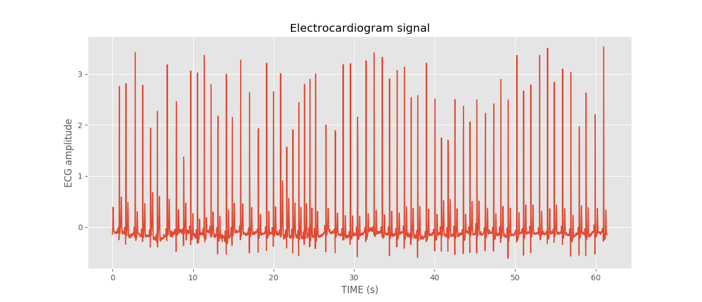


### Summary of HR/BR Estimation algorithms

This analysis is performed using public wrist-worn accelerometer datasets(sources mentioned above). Since the ground truth values of HR/BR is not known, it's hard to calculate the mean absolute error rate or deviation. This will be done when true values are obtained and verified with this implementation of algorithms.

### How to run locally?

To install all the dependencies, run the following command. This assumes you already have `python3` and `pip3` installed.

```
make init
```

To run the project on all three included datasets along with plots, run below command. This gives detailed comparision of above mentioned three algorithms on all datasets.

```
make run
```

## Bio Watch

This work presents the estimation of heart and breathing rates from wrist motions, based on Ballistocardiography(BCG). It provides methods for extracting the cardiac and respiratory signals from accelerometer/gyroscope data obtained using a wrist worn sensor. After preprocessing the data, a bandpass butterworth filter is applied to isolate the BCG changes. Different components(x,y,z) of each sensor are aggregated and a band-pass butterworth filter is applied to obtain final pulse wave. Similarly, respiratory wave is obtained by applying a averaging filter and choosing component with highest periodicity level. From pulse and respiratory waves, HR and BR are estimated in frequency domain by identifying the frequency with highest amplitude.

### System Overview for Heart Rate and Respiratory Rate

1. Accelerometer Data

Though this estimation approach can be applied on data obtained from accelerometer and/or gyroscope, only accelerometer data is used in this analysis.


2. Normalization with z-score

The data is preprocessed by normalizing the X, Y, Z axes of accelerometer values with z-scores to give them same relevance. 

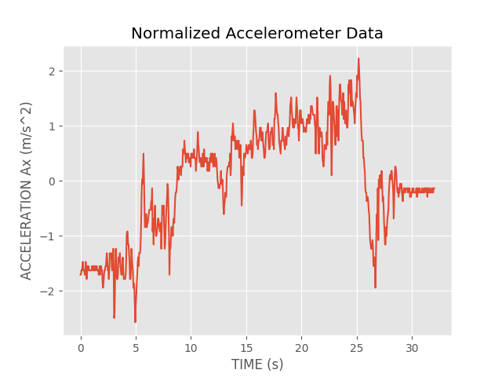

3. Estimation of Pulse wave and pulse rate

* Averaging filter for each component to smoothen data
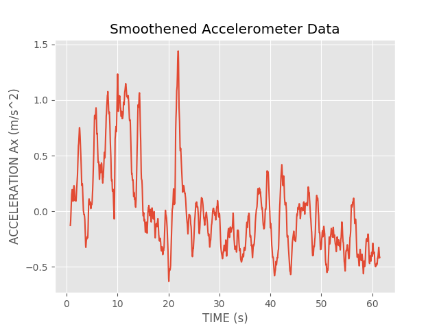

* Band pass butterworth filter of order 2 (4 Hz - 11 Hz)
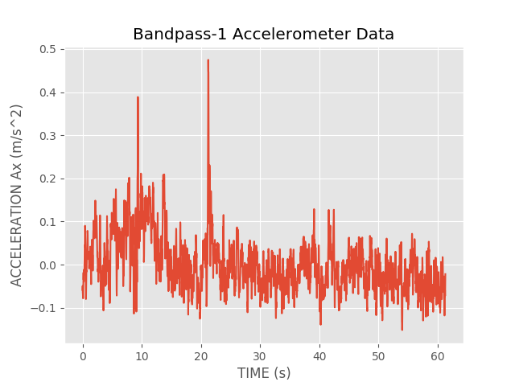

* Aggregate components
* Band pass butterworth filter of order 2 (0.66 Hz - 2.5 Hz)
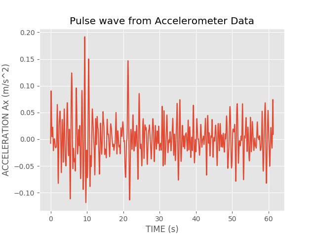

* Apply FFT to obtain Heart rate in frequency domain
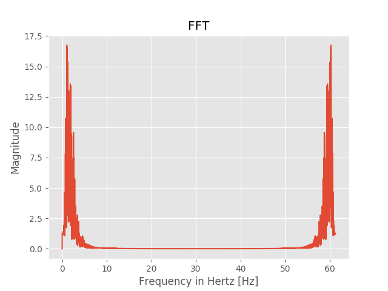

4. Estimation of Respiratory wave and respiration rate

* Apply averaging filter
* Apply FFT to obtain Respiratory rate in frequency domain on each component and choose one component with most periodic signal. The  periodicity  level  was  defined as the maximum amplitude observed within 0.13 and 0.66 Hz in the frequency domain (corresponding  to 8 and 40 breaths per minute, respectively). 

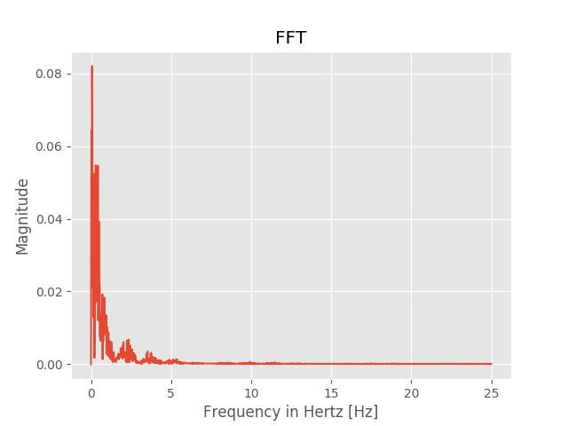

### Output

```sh
$ python3 bio_watch.py
Max Amplitude: 16.751657650637757
Max Frequency: 1.0403393148450244
Heart Rate (bpm): 62.420358890701465
Max Amplitude within 0.13 and 0.66 Hz frequency:
X-Axis: 166.01035262050667
Y-Axis: 120.777797237787
Z-Axis: 115.25675615869969
Max amplitude chosen: 166.01035262050667
Frequency of chosen amplitude: 0.3601186943620178
Respiratory Rate (bpm): 21.60712166172107
```

## Sleep Monitor

This paper presents a technique to monitor respiratory rate and body position from accelerometer data. It uses a filter(Total Variation filter) to extract the weak respiratory signal from noisy data and does frequency analysis to estimate respiratory rate. Rather than just using a average of estimates from each axis, it uses a multi-axis fusion approach to improve estimation accuracy.

### System Overview for Respiratory rate

1. Raw Accelerometer Data

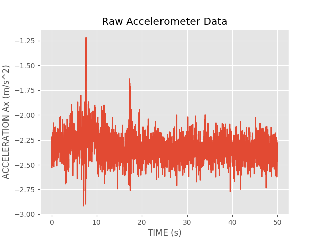

2. Segmentation

Since SleepMonitor is designed to work in motionless sleep, it removes the data segments which might involve any movements by user. In a window, if there are more than 5% of samples with acceleration greater than a threshold(10ms^2), it is discarded.

3. Processing - Total Variation filter

To extract fluctuations caused by respiration from weak and noisy data, a total variation filter is used for denoising. This gives a filtered signal which is very smooth and smoothness level can be controlled by λ(regularization parameter) which is set to 5 in this system. In this analysis, Total Variation Filtering is implemented using the approach given [here](http://eeweb.poly.edu/iselesni/lecture_notes/TV_filtering.pdf)

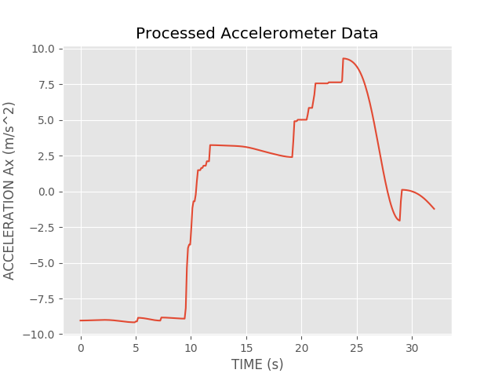

4. Fast Fourier Transform

To estimate respiratory rate on each axis, FFT is applied on filtered data and converted to time domain signal. Only components with frequencies lesser than 0.5Hz is considered and DC components are removed. The respiratory rate in Hertz is the frequency of the component with highest magnitude.

5. Multi axis fusion - Kalman filter

To fuse the estimates from X, Y, Z axes rather than averaging the rates, it uses a multi-axis fusion by implementing a Kalman filter(KF). Here, historical repiratory rates are used for prediction and current estimate is used as measurement for model.

### Output

```sh
$ python3 sleep_monitor.py
Segmenting data...
Number of segments: 2
Size of each segment: 1536
Removing segments with motion...
Number of filtered segments: 2
Number of records: 3072
Denoisifying data...
Converting time domain signal to frequency domain by FFT...
X-Axis
Max Amplitude: 19.409012679761673
Respiratory rate: 0.1400455877564311
Respiratory rate (bpm): 8.402735265385866
Y-Axis
Max Amplitude: 11.459828693993831
Respiratory rate: 0.1400455877564311
Respiratory rate (bpm): 8.402735265385866
Z-Axis
Max Amplitude: 15.715620986587833
Respiratory rate: 0.1400455877564311
Respiratory rate (bpm): 8.402735265385866
Average Respiratory rate (bpm): 8.402735265385866
Performing multi-axis fusion by Kalman filter...
Breathing rate from Kalman filter: 8.442211055276381
```

## Seismotracker

This approach relies on Seismocardiography(SCG) and tracks Heart rate, Respiratory rate and microvibrations of muscles. On normalized accelerometer data, FFT is applied from which respiratory rate is estimated. In the next stage, a high pass and low pass filtering is performed which gives pulse wave. The heart rate is estimated from this signal in frequency domain.

Assumptions made:
* This paper does not mention the cut-off frequencies for low pass filtering. In the analysis, `0.66` is used since it corresponds to normal 40 beats per minute for heart rate.
* In estimation of heart rate, it mentions a step of squaring the signal after low pass filtering. However, it is not performed in analysis as it makes the frequency ranges out of bound. The reason for it has to be verified.

### System Overview for Heart Rate and Respiratory Rate

1. Raw Accelerometer Data

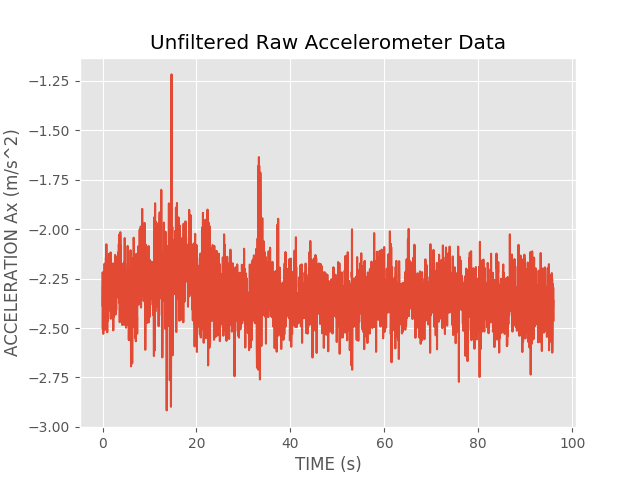

2. Preprocessing - Normalize

3. Respiratory Rate estimation based on prevalent signal amplitude in frequency domain

X-Axis:

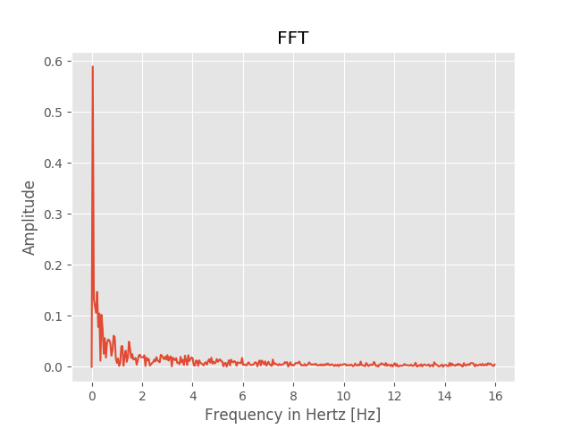

4. High pass filter

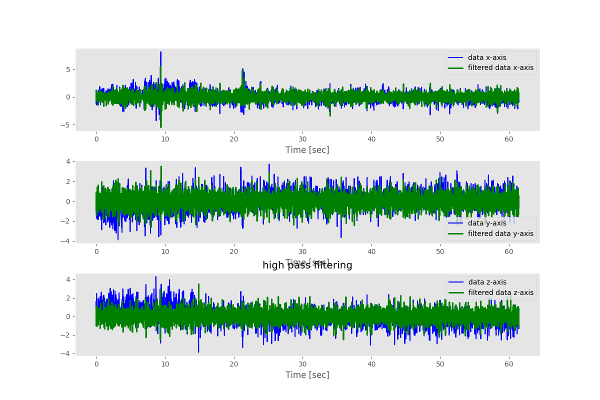

5. Low pass filter

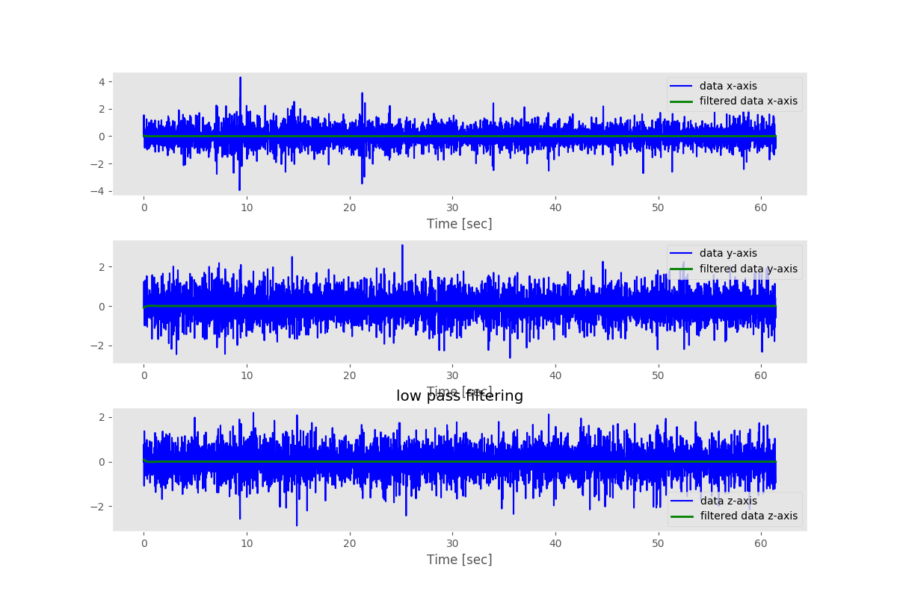

6. Heart Rate Estimation - FFT

X-Axis:

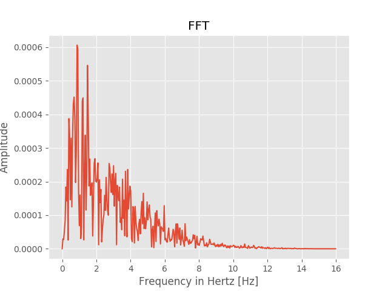

All the plots of this algorithm are available [here](https://github.com/apoorvam/smart-sensing/tree/master/plots/seismotracker).

### Output

```zsh
$ python3 seismotracker.py
Breathing Rate:
X-Axis:
Max Amplitude: 206.3525109611608
Frequency: 0.3601172256593943
Respiration Rate (bpm): 21.60703353956366
Y-Axis:
Max Amplitude: 181.17474579186927
Frequency: 0.1400455877564311
Respiration Rate (bpm): 8.402735265385866
Z-Axis:
Max Amplitude: 206.0686156672978
Frequency: 0.1400455877564311
Respiration Rate (bpm): 8.402735265385866
Average Respiration Rate (bpm): 12.80416802344513

Heart Rate:
X-Axis:
Max Amplitude: 0.39122616870886334
Frequency: 0.6602149137088895
Heart Rate (bpm): 39.61289482253337
Y-Axis:
Max Amplitude: 0.8094572313012403
Frequency: 0.8002605014653207
Heart Rate (bpm): 48.01563008791924
Z-Axis:
Max Amplitude: 0.8001946996777255
Frequency: 0.8602800390752197
Heart Rate (bpm): 51.61680234451318
Average Heart Rate (bpm): 46.41510908498859

```