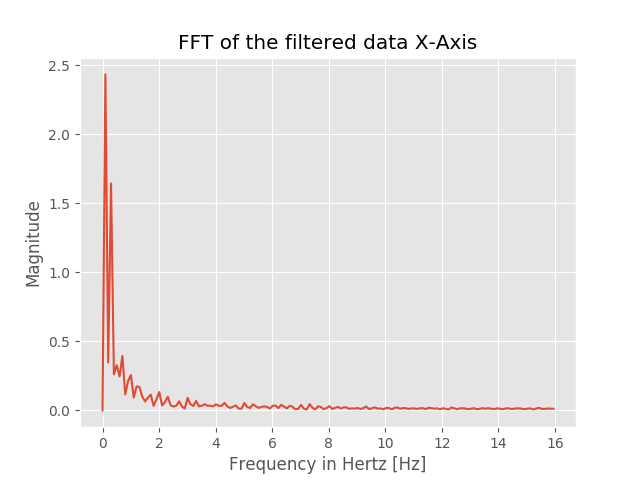
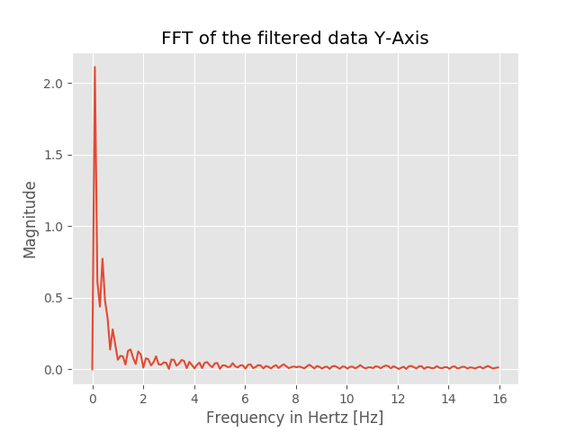
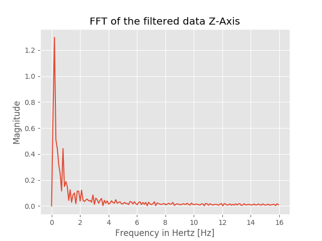
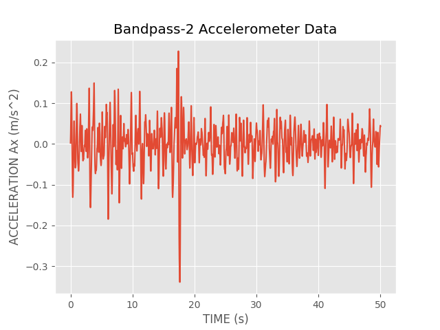
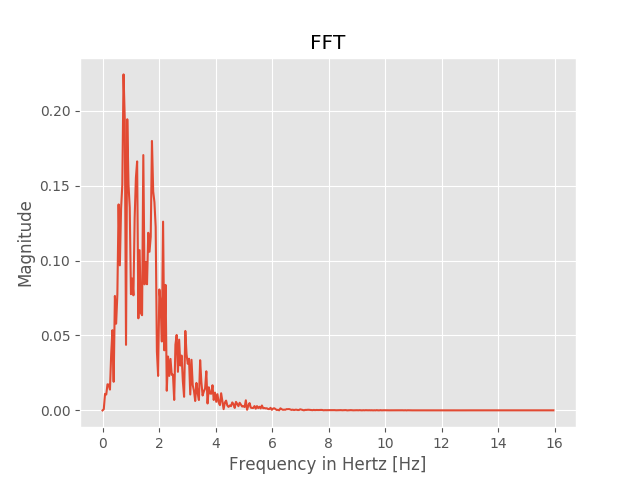
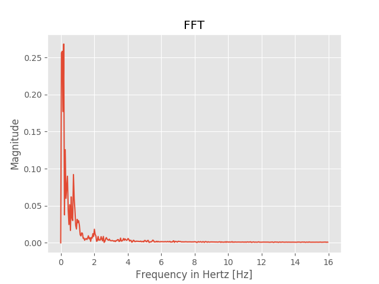
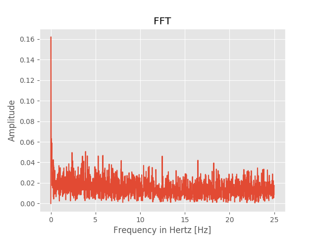
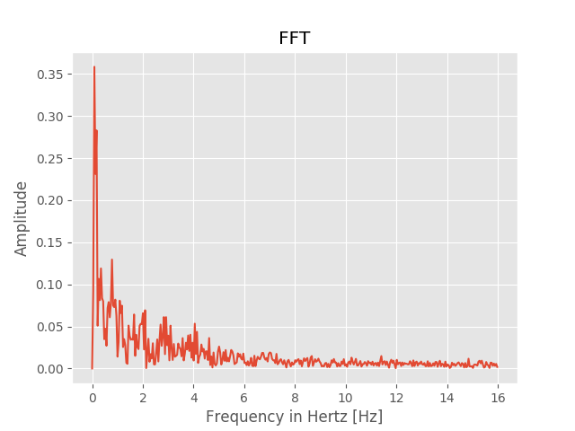
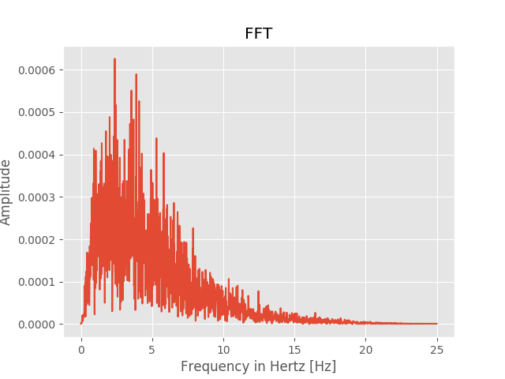
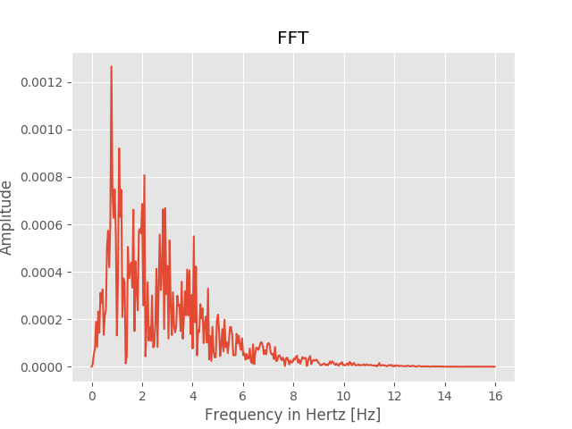

# Smart-Sensing

Analysis of various HR/BR estimation algorithms from accelerometer data. The goal is to extract/summarize the resting-state respiration rate and/or heart rate from wrist-accelerometer data. 

Dataset used: https://archive.ics.uci.edu/ml/datasets/Dataset+for+ADL+Recognition+with+Wrist-worn+Accelerometer

1. [Sleep Monitor](http://mcn.cse.psu.edu/paper/xiaosun/ubicomp-xiao17.pdf)
2. [Bio Watch](https://ieeexplore.ieee.org/abstract/document/7349394)
2. [SeismoTracker](https://dl.acm.org/citation.cfm?id=2892279)

## Sleep Monitor

### System Overview for Respiratory rate

1. Raw Accelerometer Data


2. Segmentation

3. Processing - Total Variation filter


4. FFT - Respiratory rate estimation on each axis





5. Multi axis fusion - Kalman filter

### Output

```sh
$ python3 sleep_monitor.py
Number of records: 736
Segmenting data...
Number of segments: 23
Size of each segment: 32
Removing segments with motion...
Number of filtered segments: 10
Number of records: 320
Denoisifying data...
Converting time domain signal to frequency domain by FFT...
Performing multi-axis fusion by Kalman filter...
Breathing rate from Kalman filter: 15.1181102362
```

## Bio Watch

Estimation of heart and breathing rates from wrist motions, based on Ballistocardiography.

### System Overview for Heart Rate and Respiratory Rate

1. Accelerometer Data


2. Normalization with z-score

X, Y, Z axes of accelerometer values are normalized with z-scores to give them same relevance. 


3. Estimation of Pulse wave and pulse rate

* Averaging filter for each component to smoothen data


* Band pass butterworth filter of order 2 (4 Hz - 11 Hz)


* Aggregate components
* Band pass butterworth filter of order 2 (0.66 Hz - 2.5 Hz)


* Apply FFT to obtain Heart rate in frequency domain


4. Estimation of Respiratory wave and respiration rate

* Apply averaging filter
* Apply FFT to obtain Respiratory rate in frequency domain on each component and choose one component with most periodic signal. The  periodicity  level  was  defined as the maximum amplitude observed within 0.13 and 0.66 Hz in the frequency domain (corresponding  to 8 and 40 breaths per minute, respectively). 



### Output

```sh
$ python3 bio_watch.py
Number of records: 736
Max Amplitude: 164.356553437
Max Frequency: 0.743169398907
Heart Rate (bpm): 44.5901639344
Max Amplitude within 0.13 and 0.66 Hz frequency:
X-Axis: 83.7839707083
Y-Axis: 134.28961208
Z-Axis: 193.645331484
Max amplitude chosen: 193.645331484
Frequency of chosen amplitude: 0.179523141655
Respiratory Rate (bpm): 10.7713884993
```

## Seismotracker

Based on Seismocardiography(SCG) approach.

### System Overview for Heart Rate and Respiratory Rate

1. Raw Accelerometer Data


2. Preprocessing - Normalize

3. Respiratory Rate estimation
- based on prevalent signal amplitude in frequency domain

X-Axis:


Y-Axis:



Z-Axis:



4. High pass filter


5. Low pass filter


6. Heart Rate Estimation - FFT

X-Axis:


Y-Axis:



Z-Axis:



### Output

```zsh
$ python3 seismotracker.py
Number of records: 736
Breathing Rate
--------------
X-Axis:
Max Amplitude: 433.453768883
Frequency: 0.043537414966
Respiration Rate (bpm): 2.61224489796
Y-Axis:
Max Amplitude: 349.206476224
Frequency: 0.043537414966
Respiration Rate (bpm): 2.61224489796
Z-Axis:
Max Amplitude: 263.877034229
Frequency: 0.087074829932
Respiration Rate (bpm): 5.22448979592

Heart Rate
----------
X-Axis:
Max Amplitude: 0.445972110173
Frequency: 0.87074829932
Heart Rate (bpm): 52.2448979592
Y-Axis:
Max Amplitude: 0.549721723143
Frequency: 1.00136054422
Heart Rate (bpm): 60.0816326531
Z-Axis:
Max Amplitude: 0.930872303024
Frequency: 0.783673469388
Heart Rate (bpm): 47.0204081633

```