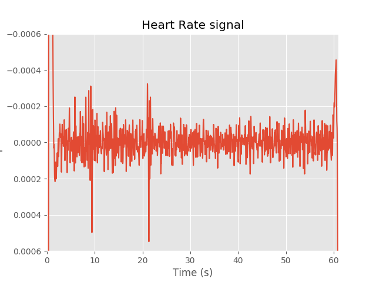

# Comparision of Algorithms

## Results 

[Dataset 1](https://archive.ics.uci.edu/ml/datasets/MHEALTH+Dataset): (datasets/uic_dataset.csv) - Sleep data

## Heart Rate Estimation

|               | Heart Rate(bpm) |
|---------------|-----------------|
| Bio Watch     | 62.420359       |
| SeismoTracker | 46.415109       |
| Sleep Monitor | -               |

**True Heart rate of `Dataset 1` is: 64. Below is the plot of true heart rate.**

### BioWatch

### SeismoTracker

#### Analysis

For the above dataset having sampling frequency of `50Hz`, the ground true heart rate is `64 bpm`. With BioWatch, this estimate came close to `62.42 bpm` and Seismotracker gives `46.42 bpm`. However, Seismotracker is missing some details from the paper, so there is scope for correcting the implementation. Overall, BioWatch gives better performance.

## Breathing Rate Estimation

|               | Breathing Rate(bpm) |
|---------------|---------------------|
| Bio Watch     |21.607122            |
| SeismoTracker |12.804168            |
| Sleep Monitor |8.442211             |

Since the ground truth values of BR is not known, it's hard to calculate the mean absolute error rate or deviation. This will be done when true values are obtained and verified with this implementation of algorithms.
